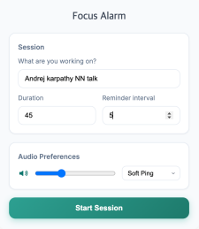

# Focus Alarm (MV3)

A beautiful, minimal Chrome extension that gently plays a soft sound every X minutes to remind you to stay focused on your current task.

## Screenshots

### Setup View

*Configure your focus session with task description, duration, and reminder intervals*

### Active Session View

*Monitor your progress with live timer, task pills, and audio controls*

## Features

- **8 Beautiful Sound Options** - Choose from Soft Ping, Gentle Bell, Crystal Tone, Zen Gong, and more
- **Customizable Intervals** - Set your own focus duration and reminder frequency
- **Live Progress Tracking** - Visual timer with progress bar and task pills
- **Volume Control** - Adjust audio level with live preview
- **Session Management** - Start, pause, and end sessions with intuitive controls
- **Clean, Modern UI** - Apple SD Gothic Neo typography with beautiful gradients

## Installation (Developer Mode)

1. Open Chrome → Extensions → toggle Developer mode
2. Click "Load unpacked" and select this `NudgeMe` folder
3. Pin the extension and click the icon to start a session

## Usage

1. **Setup Session**: Enter what you're working on, set duration and reminder interval
2. **Choose Audio**: Select from 8 different sound options and adjust volume
3. **Start Focus**: Click "Start Session" to begin your focused work
4. **Monitor Progress**: Watch the live timer and progress bar
5. **Control Session**: Use "Mute Alerts" to pause reminders or "End Session" to stop

## Technical Details

- **Manifest V3** - Latest Chrome extension standard
- **WebAudio API** - Synthesized sounds (no external assets needed)
- **Offscreen Document** - Background audio playback
- **Chrome Storage** - Persistent settings and session state
- **Alarms API** - Precise timing for reminders

## File Structure

```
NudgeMe/
├── manifest.json          # Extension manifest
├── popup.html/css/js      # Main UI interface
├── background.js          # Service worker for session management
├── offscreen.html/js      # Audio playback system
├── options.html/js        # Settings page
├── icons/                 # Extension icons (16px to 256px)
└── screenshots/           # UI screenshots for documentation
```

## Notes

- All audio is synthesized using WebAudio API - no external sound files needed
- Extension works offline once installed
- Settings persist across browser sessions
- Compatible with Chrome, Edge, and other Chromium-based browsers


